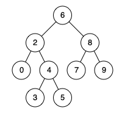

# 235. Lowest Common Ancestor of a Binary Search Tree

Date (of first attempt): 03/29/2024  
Difficulty: Medium  
Topics: Tree  
Question Link: https://leetcode.com/problems/lowest-common-ancestor-of-a-binary-search-tree/description/

## Problem

```
Given a binary search tree (BST), find the lowest common ancestor (LCA) node of two given nodes in the BST.

According to the definition of LCA on Wikipedia: “The lowest common ancestor is defined between two nodes p and q as the lowest node in T that has both p and q as descendants (where we allow a node to be a descendant of itself).”

 

Example 1:
Input: root = [6,2,8,0,4,7,9,null,null,3,5], p = 2, q = 8
Output: 6
Explanation: The LCA of nodes 2 and 8 is 6.
```



## Solutions

### Recursive

Basic recursion, remember properties of a Binary Search Tree (left < curr ≤= right). 

```python
class Solution(object):
    def lowestCommonAncestor(self, root, p, q):
        if not root: 
            return None
        if p.val > q.val:
            p, q = q, p
        if p.val <= root.val <= q.val:
            return root
        if root.val > p.val: # root.val also > q
            return self.lowestCommonAncestor(root.left, p, q)
        else:
            return self.lowestCommonAncestor(root.right, p, q)

# Time: O(N) where N is number of nodes. Worst case we visit all nodes of BST.
# Space: O(N); max space used by recursive stack is N (stick tree).
```

### Iterative

Can also do iteratively. Same as recursive but keep while looping going until curr = None (past the leaf node). May prefer because more space efficient.

```python
class Solution(object):
    def lowestCommonAncestor(self, root, p, q):
        if not root: 
            return None
        if p.val > q.val:
            p, q = q, p

        curr = root
        while curr:
            if p.val <= curr.val <= q.val:
                return curr
            if curr.val > p.val:
                curr = curr.left
            else:
                curr = curr.right
        
        return None

# Time: O(N) where N is number of nodes. Worst case we visit all nodes of BST.
# Space: O(1)
```