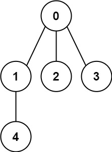

# 261. Graph Valid Tree

Date (of first attempt): 04/19/2024  
Difficulty: Medium  
Topics: DFS, Tree, Undirected Graph, Union Find  
Quick Notes: If G is fully connected AND has exactly N-1 edges, then G MUST be a tree.  
< N-1 edges → not fully connected  
\> N-1 edges → must contain a cycle  
If we know G has exactly N-1, we can use DSU to check for cycles (see if there’s a failed merge).  

## Problem

```
You have a graph of n nodes labeled from 0 to n - 1. You are given an integer n and a list of edges where edges[i] = [ai, bi] indicates that there is an undirected edge between nodes ai and bi in the graph.

Return true if the edges of the given graph make up a valid tree, and false otherwise.

 

Example 1:

Input: n = 5, edges = [[0,1],[0,2],[0,3],[1,4]]
Output: true
```




## Solutions

### DFS

Tree iff:

G is **fully connected**. For every pair of nodes, there is a path between them.

G contains **no cycles**. For every pair of nodes, there is exactly 1 path between them.

Number of Edges must be N-1 exactly to be a tree. 

Any less → not fully connected

Any more → must contain a cycle

To avoid trivial case where we check the same edge again (A ↔ B), keep note of the parent of the current node and check if it’s child is actually it’s parent.

### Recursive

Cleaner, pass in parent directly instead of keeping a separate data structure. 

```python
class Solution(object):
    def validTree(self, n, edges):
        if len(edges) != n-1:
            return False
        
        adj = defaultdict(list)
        for a, b in edges:
            adj[a].append(b)
            adj[b].append(a)
        
        visited = set()

        def dfs(node, parent):
            if node in visited:
                return False
            visited.add(node)
            for child in adj[node]:
                if child == parent:
                    continue
                if child in visited:
                    return False
                if not dfs(child, node):
                    return False
            return True
        
        return dfs(0, -1) and len(visited) == n
            
# Time: O(N+E) where N is num of nodes, E is num of edges
    # Creating adj list inits list of length N -> O(N)
    # Iterate through E edges -> O(E)
    # Each node is added exactly once. 
        # For each node, its adj edges are traversed exactly once.
        # Thus all N nodes and E edges are traversed exactly once.
        # -> O(N+E)
# Space: O(N+E)
    # adj is a list of length N
        # length of inner lists add up to E
        # -> O(N+E)
    # worst case stack -> O(N)
```

### Iterative

```python
class Solution(object):
    def validTree(self, n, edges):
        if len(edges) != n-1:
            return False
        
        adj = defaultdict(list)
        for a, b in edges:
            adj[a].append(b)
            adj[b].append(a)
        
        parent = {0: -1}
        stack = [0]

        while stack:
            node = stack.pop()
            for child in adj[node]:
                if child == parent[node]:
                    continue
                if child in parent:
                    return False

                parent[child] = node
                stack.append(child)
        
        return len(parent) == n
```

### Iterative

```python
class Solution(object):
    def validTree(self, n, edges):
        if len(edges) != n-1:
            return False
        
        adj = defaultdict(list)
        for a, b in edges:
            adj[a].append(b)
            adj[b].append(a)
        
        parent = {0: -1}
        stack = [0]

        while stack:
            node = stack.pop()
            for child in adj[node]:
                if child == parent[node]:
                    continue
                if child in parent:
                    return False

                parent[child] = node
                stack.append(child)
        
        return len(parent) == n
```

### Better DFS

Intuition:

If G is fully connected AND it contains n-1 edges, than it MUST be a tree.

To check if G is fully connected is way easier, simply check if all nodes were reachable from a search starting from “first” node. 

```python
class Solution(object):
    def validTree(self, n, edges):
        if len(edges) != n-1:
            return False
        
        adj = defaultdict(list)
        for a, b in edges:
            adj[a].append(b)
            adj[b].append(a)
        
        # check fully connected
        visited = set()
        def dfs(node):
            if node in visited: return
            visited.add(node)
            for child in adj[node]:
                dfs(child)
        
        dfs(0)
        return len(visited) == n
        
    # Time: O(N)
        # Worst case when E = N-1 exactly
        # Creating adj list = O(N+E) -> O(N)
        # inner loop runs ONCE for each node:
            # across all node, loop runs E number of cycles
            # -> O(N+E) = O(N)
    # Space: O(N)
        # Adj list, worst case stack frame

    # Given G, for G to be a valid tree:
        # G must have exactly n-1 edges
            # Less -> not fully connected
            # More -> contains cycle
        # In other words:
            # if G is fully connected AND has exactly n-1 edges,
            # then G MUST be a tree. :)
```

### Union Find

Intuition: 

If we know E = N-1 exactly, then this is a candidate for a valid tree.

Iterate through all N-1 edges, if there is ever a failed merge, this means the 2 nodes were already connected via a path. And the current operation adds an additional path b/w them → CYCLE. 

```python
class Solution(object):
    def validTree(self, n, edges):
        if len(edges) != n-1: return False

        # implement "find" w/ path compression
        # implement "union" with union by size

        for A, B in edges:
            if not union(A, B): 
                # if parentA == parentB, no merge -> must be cycle.
                return False
        
        return True

    # Time: O(N) basically
        # E=N-1 worst case, iterate through all edges.
            # perform union ~O(1) for ea. edge
    # Space: O(N)
        # union-find's parent/size arrays

    # union find (optimized)
    # after ensuring E == N-1:
        # if can show that graph is CONNECTED -> tree
        # graph is connected if all nodes end up in the same set
        # after performing union-find for all edges.
```